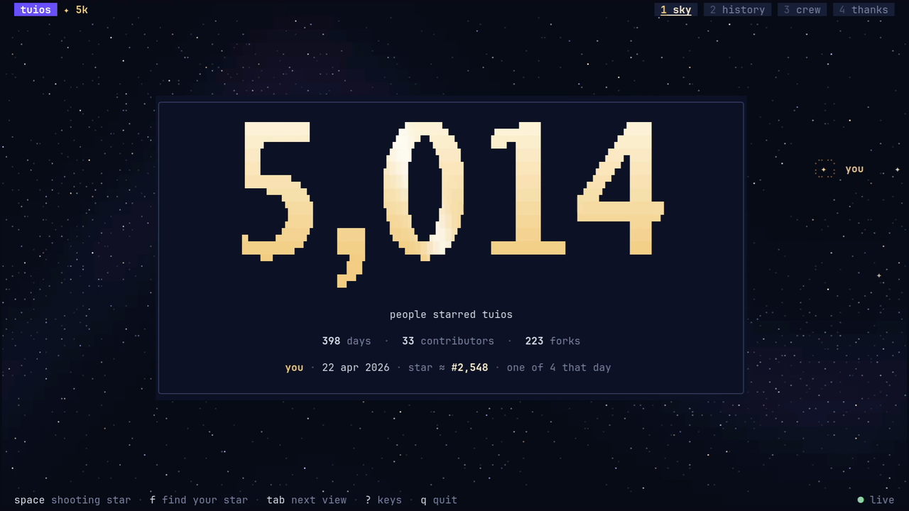
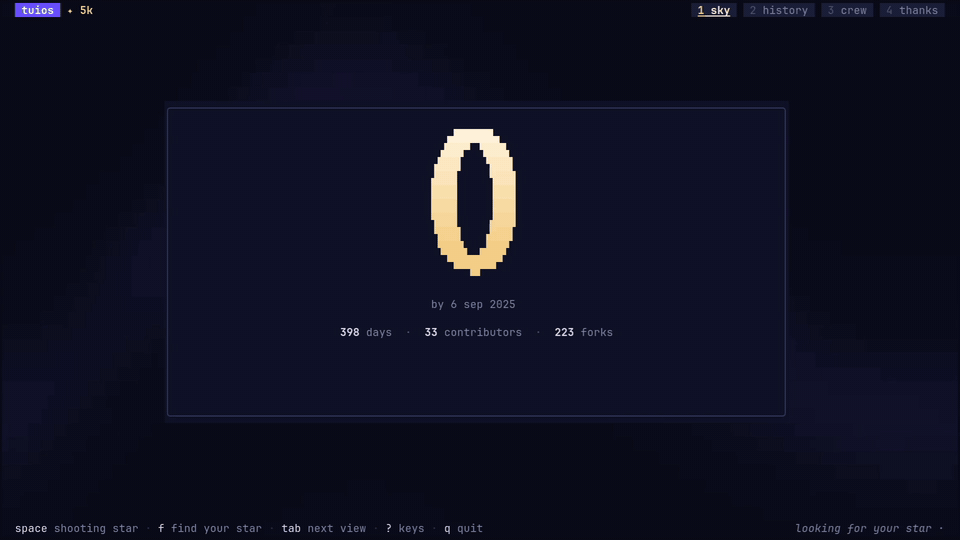

# tuios ✦ 5k

[tuios](https://github.com/Gaurav-Gosain/tuios) has 5,000 stars. This is a
small terminal program to say thank you. It draws a night sky with one dot for
each person who starred the repo, and it can find your own dot.



## Run it

```sh
go run github.com/Gaurav-Gosain/tuios-5k@latest
```

To find your own star at once:

```sh
go run github.com/Gaurav-Gosain/tuios-5k@latest -me YOUR_GITHUB_LOGIN
```

You need Go 1.25 or newer and a terminal of at least 80×24. Truecolor looks
best. A 256-colour terminal also works. When you quit, the program leaves one
line in your scrollback.



## Views

| Key | View | What it shows |
| --- | --- | --- |
| `1` | sky | The star count. It counts up through the history while the sky fills, and it stops for a moment at 5,000. |
| `2` | history | Stars over time, with the 1k and 5k marks and the three best days. |
| `3` | crew | Every contributor as a star, joined in the order of their first commit. |
| `4` | thanks | The install command and the repo link. |

## Keys

- `tab` and `shift+tab` go to the next and the previous view. You can also click a tab.
- `f` finds your star. Type your GitHub login and press `enter`.
- `space` sends a shooting star.
- `←` and `→` scrub the history and walk the crew. The mouse wheel does the same.
- `shift+←` and `shift+→` move one week in the history.
- `[` and `]` jump between the marks in the history.
- `r` plays the count again. `enter` skips it.
- `c` copies the install command on the thanks view.
- `?` shows all keys. `q` quits.

Click a star in the crew view to select it. Click or drag on the chart to move
the cursor. Run the program inside a tuios pane for a small extra.

## Find your star

Press `f`, or start with `-me LOGIN`. The program reads your public list of
starred repos from GitHub, newest first. It reads at most five pages of 100.
It takes the day you starred tuios and picks one dot from the stars of that
day. The pick comes from your login, so it is the same dot on every run.

The program shows only the login that you type. It never shows the names of
other stargazers.

## Data

The program asks the GitHub REST API for the star count, the fork count and
the contributors. It does not need a token. Bots are not shown.

GitHub asks for a token to list stargazers with dates. So the star history
comes from a snapshot in `data/snapshot.json`, which is built into the
binary. The snapshot holds the number of stars for each day and no names. When
GitHub cannot be reached, everything comes from the snapshot, and the status
bar shows "offline snapshot" and the date of the snapshot.

GitHub allows 60 requests an hour without a token. If you reach that limit,
set `TUIOS_5K_TOKEN` to a GitHub token.

Flags:

- `-offline` uses the snapshot only and makes no network calls.
- `-view NAME` opens a view: `sky`, `history`, `crew` or `thanks`.
- `-me LOGIN` finds the star of LOGIN when the sky has filled.

To refresh the snapshot, run this with a token:

```sh
GITHUB_TOKEN=$(gh auth token) go run ./cmd/snapshot > data/snapshot.json
```

## How it is drawn

The sky sits behind every panel, so the frame is one grid of cells that the
program composes itself, layer by layer: the haze, the stars, the panels, the
text. Bubble Tea runs the loop and sends only the cells that change. The big
numbers are Go Bold, set at run time into quadrant blocks. The chart is drawn
with eighth blocks, and the lines with braille. The header copies the tuios
dock: its mode pill in the tuios accent, and the views as workspace pills.

The frame rate follows what moves: 30 fps for a transition or a shooting star,
20 fps for the count, and 10 fps when only the stars twinkle.

## Credits

Thank you to everyone who starred tuios, filed an issue or sent a patch.

The tuios contributors, in the order of their first commit:
[Gaurav-Gosain](https://github.com/Gaurav-Gosain), [humaidq](https://github.com/humaidq), [cr2007](https://github.com/cr2007), [ShalokShalom](https://github.com/ShalokShalom), [Cjreek](https://github.com/Cjreek), [NSPC911](https://github.com/NSPC911), [Gsirawan](https://github.com/Gsirawan), [mathomp4](https://github.com/mathomp4), [jacob-sabella](https://github.com/jacob-sabella), [kylesnowschwartz](https://github.com/kylesnowschwartz), [dodorz](https://github.com/dodorz), [SebaWag](https://github.com/SebaWag), [ethanhawkes-gif](https://github.com/ethanhawkes-gif), [actes2](https://github.com/actes2), [FaintFlower](https://github.com/FaintFlower), [noomz](https://github.com/noomz), [ronisbr](https://github.com/ronisbr), [masshirodev](https://github.com/masshirodev), [fonnesbeck](https://github.com/fonnesbeck), [nathan-poncet](https://github.com/nathan-poncet), [NotAFlightRisk](https://github.com/NotAFlightRisk), [Tim4c](https://github.com/Tim4c), [davidreuss](https://github.com/davidreuss), [neomantra](https://github.com/neomantra), [JakeChop](https://github.com/JakeChop), [fdoving](https://github.com/fdoving), [zer0ken](https://github.com/zer0ken), [chenxin-yan](https://github.com/chenxin-yan), [ci4ic4](https://github.com/ci4ic4), [juancely](https://github.com/juancely), [j4ng5y](https://github.com/j4ng5y), [dreuss](https://github.com/dreuss), [drawde-nadroj](https://github.com/drawde-nadroj).

Built with [Bubble Tea](https://github.com/charmbracelet/bubbletea),
[Lip Gloss](https://github.com/charmbracelet/lipgloss) and
[Bubbles](https://github.com/charmbracelet/bubbles) by Charm. The display face
is [Go Bold](https://go.dev/blog/go-fonts) by Bigelow & Holmes.

## License

[MIT](LICENSE)
